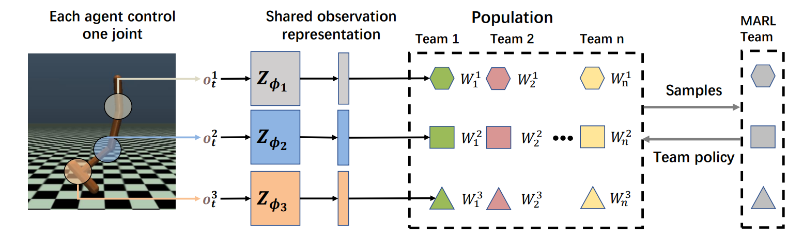
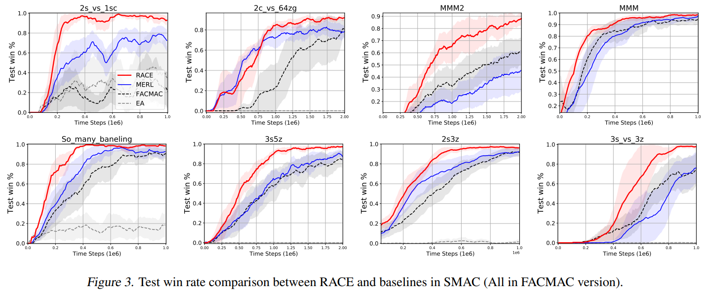

myself:
  source /data/gu-di/miniconda3/etc/profile.d/conda.sh
  conda activate race
  export LD_LIBRARY_PATH=$LD_LIBRARY_PATH:/data/gu-di/.mujoco/mujoco200/bin
  cd RACE/


smac环境：
  ```
  python3  src/main.py --config=facmac_smac --env-config=sc2 with env_args.map_name=3s_vs_3z  batch_size_run=1 state_alpha=0.001 frac=0.005  EA_alpha=1.0  Org_alpha=1.0  EA=1  EA_freq=1 SAME=0  use_cuda=False t_max=2005000
  ```
  python3  src/main.py --config=facmac_smac --env-config=sc2 with env_args.map_name=MMM  batch_size_run=1 state_alpha=0.001 frac=0.005  EA_alpha=1.0  Org_alpha=1.0  EA=1  EA_freq=1 SAME=0  use_cuda=False t_max=2005000

救火环境：
  python3 src/main.py --config=facmac_smac --env-config=firefighters with batch_size_run=1 state_alpha=0.001 frac=0.005  EA_alpha=1.0  Org_alpha=1.0  EA=1  EA_freq=1 SAME=0  use_cuda=False t_max=15000000                   

    更改了：
      1.注册环境
      2.编写src/config/firefighters.yaml配置文件
      3.firefighter.py，加了四个接口函数
      4.src/env/init.py: def env_fn(env, **kwargs) -> MultiAgentEnv:
      5.episode_runner.py

    关键参数设计：
      1.self.bld_spacing = 3  # 建筑间最小间隔
      2.self.max_n_agents = 8  # 最大智能体数量
      3.self.max_n_buildings = 8  # 最大建筑数量
        {'entity_shape': 58, 
        'n_actions': 12, 
        'n_agents': 8, 
        'n_entities': 16, 
        'episode_limit': 150, 
        'n_tasks': 8, 
        'state_shape': 928, 
        'obs_shape': 58}
      4.AGENT_TYPES = {'F': FireFighter, 'B': Builder, 'G': Generalist}
        BUILDING_TYPES = {'F': FastBurnBuilding, 'S': SlowBurnBuilding}
      5.# 定义地图的大小
        MAP_SIZE = 16


# RACE: Improve Multi-Agent Reinforcement Learning with Representation Asymmetry and Collaborative Evolution (ICML 2023)

This repo contains the code that was used in the paper "[RACE: Improve Multi-Agent Reinforcement Learning with Representation Asymmetry and Collaborative Evolution](https://proceedings.mlr.press/v202/li23i.html)".
It includes implementations for RACE, FACMAC, FACMAC-nonmonotonic, MADDPG, COMIX, COVDN, and Independent DDPG. Our code is built upon the [FACMAC](https://github.com/oxwhirl/facmac) codebase. 

**RACE code for MA-MuJoCo is released: [https://github.com/yeshenpy/RACE-MAMuJoCo](https://github.com/yeshenpy/RACE-MAMuJoCo)**

Although the PYMARL framework can be used to run SMAC as well as MAMUJOCO, we do not run MAMUJOCO in this framework.

**If you are interested in Combing Evolutionary Algorithms and Reinforcement Learning, you can access this repository [Awesome-Evolutionary-Reinforcement-Learning](https://github.com/yeshenpy/Awesome-Evolutionary-Reinforcement-Learning) for advanced ERL works.**

<p align="center">
  <br><br>
  <br><br>
  <a href="https://proceedings.mlr.press/v202/li23i.html">[Paper]
</p>

## Setup instructions

Set up StarCraft II and SMAC:
```
bash install_sc2.sh
```

Install the dependent packages
```
pip install -r requirements.txt

# 使用阿里云镜像源
pip install -i https://mirrors.aliyun.com/pypi/simple -r requirements.txt
```

Our code uses WandB for visualization. Before you run it, please configure [WandB](https://wandb.ai/site).

## Environments

### StarCraft Multi-Agent Challenge (SMAC)
We use the SMAC environment developed by [WhiRL](https://whirl.cs.ox.ac.uk/). Please check the [SMAC](https://github.com/oxwhirl/smac) repo for more details about the environment.
Note that for all SMAC experiments, we used SC2.4.10.


## Run an experiment 

Once you have configured your environment, you can access the RACE folder and run the code with the following command

```
python3  src/main.py --config=facmac_smac --env-config=sc2 with env_args.map_name=3s_vs_3z  batch_size_run=1 state_alpha=0.001 frac=0.005  EA_alpha=1.0  Org_alpha=1.0  EA=1  EA_freq=1 SAME=0  use_cuda=False t_max=2005000

```


`state_alpha` corresponds to the hyperparameter beta to control VMM, `frac` corresponds to the hyperparameter alpha to control the mutation, and the other hyperparameters are consistent across tasks. **The code is run in serial mode and does not use multi-processing.**

The config files `src/config/default.yaml` contain hyperparameters for the algorithms.
These were sometimes changed when running the experiments on different tasks. Please see the Appendix of the paper for the exact hyper-parameters used.

For each environment, you can specify the specific scenario by `with env_args.map_name=<map_name>` for SMAC.

We found that the PYMARL framework built on SMAC did not work well on MAMUJOCO, so we rebuilt a set of repositories to run MAMUJOCO.
The code of MAMUJOCO I will release later, you can also contact me to get this source code in advance


## Citing
If you used this code in your research or found it helpful, please consider citing the following paper:

Bibtex:
```
@InProceedings{pmlr-v202-li23i,
  title = 	 {{RACE}: Improve Multi-Agent Reinforcement Learning with Representation Asymmetry and Collaborative Evolution},
  author =       {Li, Pengyi and Hao, Jianye and Tang, Hongyao and Zheng, Yan and Fu, Xian},
  booktitle = 	 {Proceedings of the 40th International Conference on Machine Learning},
  pages = 	 {19490--19503},
  year = 	 {2023},
  volume = 	 {202},
  publisher =    {PMLR}
}

```
